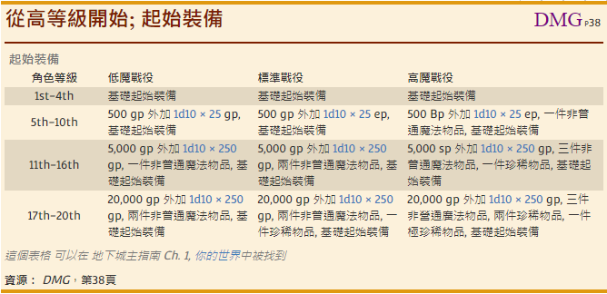
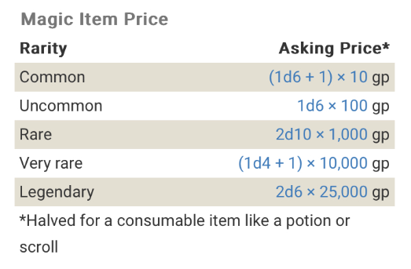
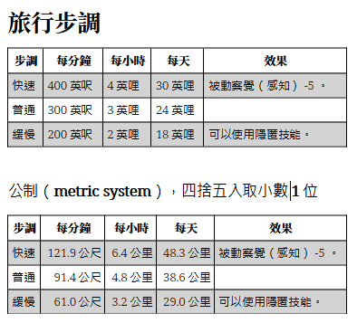
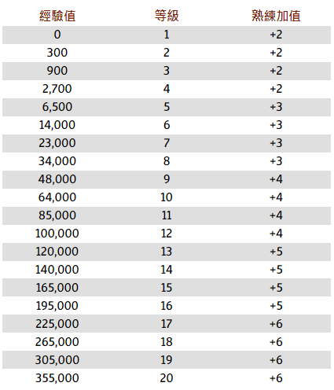

# 《深水城：瘋法師的地城》跑團規則筆記

- 一些常用的規則與房規等

給本團的玩家們：有什麼問題請不吝隨時問喔

## 玩家創角選項

### 創角規則

- 用 27 點購點
- 新角色請創 Lv 5 角色卡
- 官方規則書開： PHB、SCAG、TCE、XGE
- 其他書籍想使用的選項可以詢問看看，不一定會給。
  - VRGtR[^VRGtR] ，重生者 Reborn ，有開給玩家。
- VGM 不開。
- 角色裝備可以用起始裝備或起始金錢，買裝備的費用請參考 PHB 的裝備價格。
- 如果直接創 等級 5 的新角色來跑這團，可以用「 DMG p38 從高等級開始」章節的「起始裝備」表的「標準戰役」的規則來獲得起始的裝備與金錢。（如下圖）

[^VRGtR]: 范里希騰的鴉閣指南 Van Richten's Guide to Ravenloft

### 魔法物品的售價處理

關於魔法物品的購買規則，我是參考 XGE p.126 這個部分。因為拉斯沃德酒館（玩家在深水城裡的基地）已經是城裡小有名氣的冒險者開的酒館了，所以我就省略「尋找魔法物品」這個部分。價格可以參考這邊的定義；但選購的東西還是先貼給我確認一下比較好，雖然我覺得非普通應該都還行。購買稀有以上的魔法物品，視情況可能會有「 complications 」；這個物品本身附帶的麻煩。如下圖。

注意要提醒玩家，提出購買的時候要提出「件數」，以下價格是假設「只有一件該物品」的時候的簡單價格產生方式。我個人覺得「買一把 +1 匕首」和「買 20 把 +1 匕首」的價格應該不會只是骰一次然後乘 20 ，我的戰役裡我對魔法物品製作的想像沒有這麼容易啦。

除非大家要把酒館開發成魔法物品製作工廠之類的，也許有機會……

> 瓦羅：「我認識一個人，他認識另一個人（ I know a guy, who knows a guy. ），也許能在這方面幫忙喔！」（善意的微笑，之類）

## 冒險

### 時間

- 2023/10/10 備註：在「 聚會 00 」與「 聚會 01 」之後，老翰覺得時間的計算方式，至少在「探索地城」的部分，可能用「探索地城」的時候跑團的時間與遊戲內時間的流逝是一致的，例如：「 聚會 01 探索地城跑團時間 1.5 小時，在遊戲裡的世界的時間也過去了 1.5 小時。玩家角色們還沒離開地城，時間就暫時停在那邊」所以只要玩家們還在地城裡」，不會計算外面的商店收益、地城外也不會發生其他事件等等的，地城外的時間也暫停，至少暫時是這樣處理。

### 旅行步調、移動速度

取自 SRD 5.1 ，第 84 頁

### 戰鬥

一個戰鬥輪在遊戲世界中代表了大約 6 秒的時間。 PHB p189

### 升級經驗值表

PHB p15

經驗值平分房規：個位數經驗值不足 5 的部分取 5 ，超過 5 不足 10 的取為 10 。

## 團務整體

### 短團

老翰（《瘋法師的地城》主團務）休息的時候，玩家們如果有打算帶個短團，預計的處理方式：

1. 故事是假設在地城裡冒險的角色們作夢
2. 短團的故事可以發生在深水城或其他地方
3. 參與短團的角色可以是地城裡冒險的角色或者其他角色，但等級要符合預計帶短團的 DM 的需求
4. 短團冒險獲得的經驗值會由作夢的（在地城裡冒險的）角色獲得，魔法物品會在長休之後獲得（睡覺醒來出現在擁有的物品裡），但是無論是什麼樣的物品都只能使用一次。

短團的東西暫時這樣用吧
